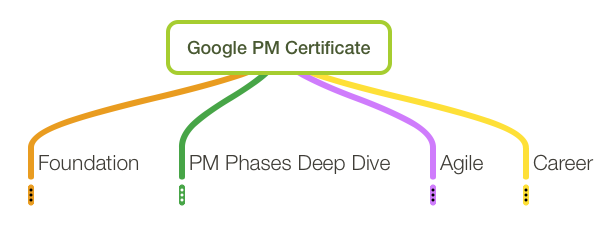
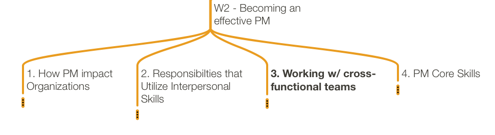
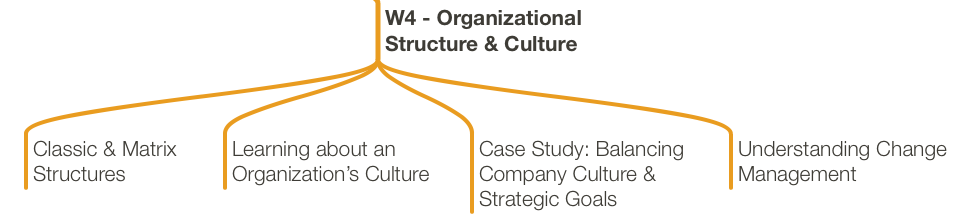

# Google Project Management: Specialization Notes Part 1

by Medhat Omr

## Intro

I'm a computer engineer, and I spend a significant amount of my time managing
computer resources, such as CPU time, memory, and IO. Maybe this is the reason
I find this specialization very interesting to me, like the normal extension
for my job, where instead of CPU time, we have team time, instead of memory,
cash, and IO, we have budget and quality management, and so on.

I found that I can divide the specialization into four parts, three main ones
and a fourth optional one. The three main parts are: PM Foundation, PM phases
deep dive, and Agile mindset & methodology, while the fourth optional part is
PM as a career.

## PM Foundation

In this course, the material is divided into four weeks, first week is more
focused on PM as a career, and will be discussed into its own section later on.

### W2 - Becoming An Effective PM

Starting from week 2, you will start to learn about becoming an effective PM as
shown below

!!! note ""
    The items in bold, are the items I'm most interested in to learn more about
    and in depth

On how PM can add value to projects and impact organizations, the PM can do so
in the following ways:

1. Focusing on the customer
1. Building a great team
1. Fostering relationships and communication
1. Managing the project
1. Breaking down barriers

Second, you will learn about PM key roles and responsibilities including
that utilize interpersonal skills.  Interpersonal skills are the behaviors you
use to interact w/ others, such as communication, active listening,
and leadership. Below are five of these key responsibilities:

1. Teaching & Mentoring
1. Building Relationships
1. Controlling Change
1. Empowering Your Team
1. Communicating Status & Concerns

Then, you will learn what it requires to manage cross-functional teams
effectively. Four main points were covered in detail, these four are:

1. Clarify Goals
1. Get team members w/ the right skills
1. Measure Progress
1. Recognize Efforts

Finally, the last point in this week is PM Core Skills, which are:

1. Enabling Decision-Making
1. Communicating & Escalating
1. Strong Organizational Skills
1. Flexibility
1. Handling Ambiguity

### W3 - PM Life Cycle & Methodologies

In this week, the course discusses the three main phases of PM life cycle:
(1) Initiate (2) Plan (3) Execute

and different PM methodologies, including:

1. Waterfall
1. Agile
1. Lean
1. Six Sigma
1. Hybrid

### W4 - Organizational Structure & Culture

This is one of the interesting topics that I'm interested in learning more about
it, and learning it in depth.

Topics covered in this week includes:

1. A comparison between Classic & Matrix organizational structures
1. Learning about an Organization's Culture
1. How to balance between company culture & strategic goals
1. Finally, understanding change management
