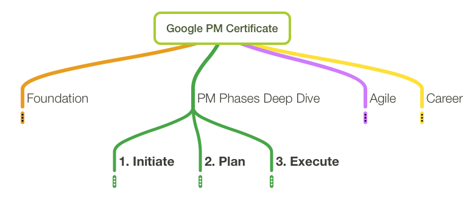
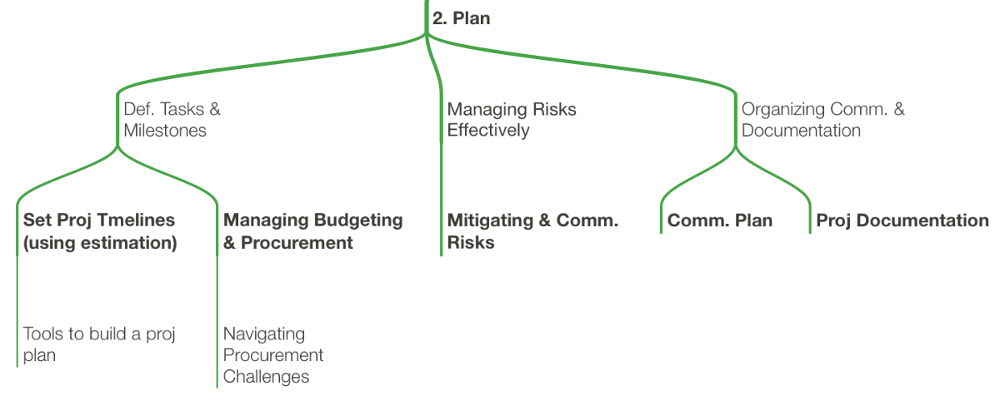

# Google Project Management: Specialization Notes Part 2a - Initiate & Plan Phases

by Medhat Omr

In this part, I like to focus more on the first two of three PM phases, known as (1) Initiate
and (2) Plan, and shown below

regarding (3) Execute, I like to separate it in its own file.

## 1. Initiate

In this phase, you can divide the work into four steps:

1. [Cost-Benefit Analysis](https://en.wikipedia.org/wiki/Cost%E2%80%93benefit_analysis)
1. Define Goals, Scope, and Success Criteria
1. Producing [RACI Chart](https://en.wikipedia.org/wiki/Responsibility_assignment_matrix)
1. Developing Documentation for Project Kick-off

!!! note ""
    Please note that, you continue to step 2 through 4 only if the cost-benefit
    analysis shows that the project is beneficial. You can't for example work
    on these steps in parallel to the cost-benefit analysis step.

## 2. Plan

In this phase, you need to work on the following items:

1. Define Tasks & Milestones
1. Manage Risks Effectively
1. Organize Communication & Project Documentation

As an output, you should have the following prepared:

1. Project Timelines
1. Project Budget & Procurement Plan
1. Mitigated & Communicated Risks
1. A Communication Plan
1. Project Documentation
