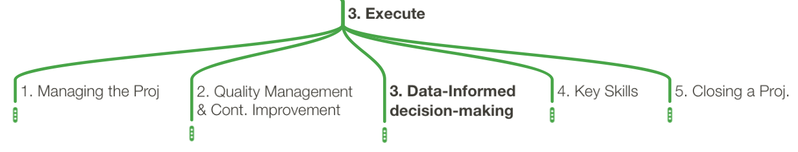

# Google PM: Specialization Notes Part 2b - (3) Execute

by Medhat Omr

In the previous part, I focused on the first two phases (1) Initiate and (2) Plan. In this part, I like to focus more on the third and final phase (3) Execute, and shown below

In this fourth course of the specialization, five topics were discussed in
the following order:

1. Managing the execution of the project
1. Quality Management & Continuous Improvement
1. Data-Informed decision-making
1. Key skills
1. Closing a Project

Managing the execution of the project can be divided into the following tasks:

1. Tracking & Measuring Progress
1. Managing Changes, Risk, and Dependencies
1. Communicate Issues to Stakeholders

Quality Management & Continuous Improvement covers the following key points

1. Quality Standards
1. Quality Planning
1. Quality Assurance (QA)
1. Quality Control (QC)

As well as, **user acceptance testing (UAT)**. For example, one way to address
UAT feedback is as follow:

- **Bugs or issues:** Users might report technical issues, also known as bugs, or other types of issues after performing UAT. You can track and monitor these issues in a spreadsheet or equivalent system and prioritize which issues to fix. For instance, critical issues, such as not being able to access, download, or search the employee handbook, need to be prioritized over non-critical issues, such as feedback on the cover art of the handbook.

- **Change requests:** Sometimes the user might suggest minor changes to the product, service, or process after UAT. These types of requests or changes should also be managed and prioritized. Depending on the type and volume of the requests, you may want to share this data with your primary stakeholders, and you may also need to adjust your project timeline to implement these new requests.

Next is Data-Informed decision-making, starting from (1) Gathering Data, (2) Prioritizing & Analyzing Data, and finally, (3) Presenting & Visualizing Data.

Data Analytics is a big topic, if you are interested, there are two other Google
specialization covers it in more details

1. [Google Data Analytics Professional Certificate](https://www.coursera.org/professional-certificates/google-data-analytics)
1. [Preparing for Google Cloud Certification: Cloud Data Engineer Professional Certificate](https://www.coursera.org/professional-certificates/gcp-data-engineering)

## Key Skills

Effective Leadership:

1. Leading high-functioning teams
1. Providing "Air Cover"
1. Team Dev. & Managing Team Dynamics
1. Delegating the Details
1. Ethical & Inclusive Leadership

The Elements of Influencing & Conger's four steps:

1. Establish Credibility
1. Frame for common ground
1. Provide evidence
1. Connect emotionally

Effective Communication (Emails & meetings):

1. Principles of effective email writing
1. Organizing & facilitating proj. meetings

## Closing a Project

1. Closing Process
1. Proj. Closeout Report
