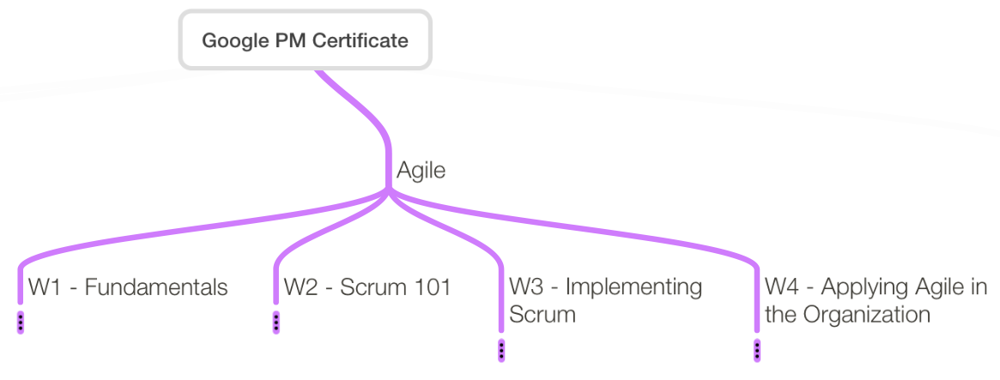
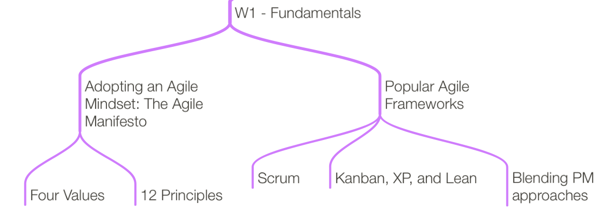

# Google Project Management: Specialization Notes Part 3

by Medhat Omr

In this part, I like to focus more on the Agile mindset and methodology part of
the specialization as shown below

## W1 - Fundamentals

Agile mindset four Values:

1. one
1. two
1. three
1. four

Agile 12 principles:

1. one
1. two
1. ...
1. ...
1. ...
1. ...
1. ...
1. ...
1. ...
1. ...
1. ...
1. ...

### Popular Agile Frameworks

1. Scrum
1. Kanban, XP, and Lean
1. Blending Approaches

## W2 - Scrum 101

The three Pillars:

1. one
1. two
1. three

The five values:

1. one
1. two
1. ...
1. ...
1. ...

[The Scrum Guide](https://www.scrum.org/resources/scrum-guide)

Scrum Roles & Responsibilities:

1. Scrum Master
1. Product Owner

## W3 - Implementing Scrum

Product Backlog

1. User Stories & Epics
1. Effort Estimation Techniques

Sprint

1. Sprint Plan & Backlog
1. Daily Scrum & Sprint Review
1. Releasable Increments vs Minimum Viable Product (MVP)
1. The Sprint Retrospective

Scrum Tools

Optional: Agile in a nutshell

## W4 - Applying Agile in the Organization

Understanding Value-Driven delivery

1. Components of a value roadmap
1. Product roadmaps: Benefits, pitfalls, and best practices
1. Creating an effective value roadmap
1. Responding to a change over following a plan

Leading through change & challenges

1. The influencer change framework
1. Coaching an Agile team
1. Agile team challenges

Agile Opportunities

1. The evolution of Agile
1. The relationship between Agile & DevOps
1. **Scaling Agile**